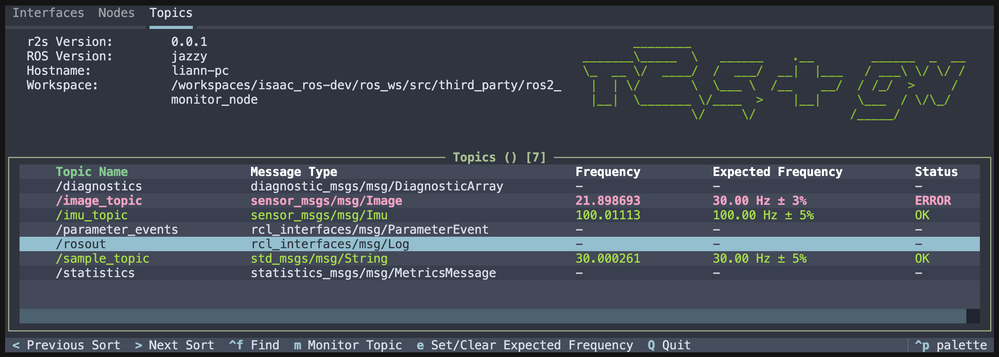

# Greenwave Monitor
Greenwave monitor is a tool for runtime monitoring of ROS 2 topics.



It provides the following features:

1. A node similar to a C++ based ros2 topic hz. i.e. subscribes to topics to determine the frame rate and latency. Compared to ros2 topic hz the greenwave node is more performant, publishes Diagnostics, and offers services to manage topics and expected frequencies.

2. A terminal based dashboard that displays the topic rates, latency, and status, and allows you to add/remove topics and set expected frequencies.

3. A header only C++ library so you can calculate and publish compatible diagnostics directly from your own nodes for reduced overhead.

This diagram shows an overview of the architecture:


For implementation details and inline integration guidance, see
[`docs/DESIGN_AND_IMPLEMENTATION.md`](docs/DESIGN_AND_IMPLEMENTATION.md).

## Compatibility

Greenwave monitor is a standalone package tested on Humble, Iron, Jazzy, Kilted, and Rolling ROS 2 releases, under Ubuntu 22.04 and Ubuntu 24.04. It does not depend on Isaac ROS. It does however play nicely with Isaac ROS NITROS diagnostics, see [`docs/DESIGN_AND_IMPLEMENTATION.md`](docs/DESIGN_AND_IMPLEMENTATION.md) for more.

## Installation

From source:
```bash
cd ros_ws/src
git clone https://github.com/NVIDIA-ISAAC-ROS/greenwave_monitor.git
cd ..
colcon build --packages-up-to greenwave_monitor
source install/setup.bash
```

## Usage

Greenwave monitor provides a lightweight ncurses dashboard for monitoring topics. An optional rich TUI (r2s integration) with additional features is also available as a separate package.

### ncurses Dashboard

After installing, you can launch the ncurses dashboard with:

```bash
ros2 run greenwave_monitor ncurses_dashboard
```

You can also launch the dashboard with some demo publishers to see everything in action:

```bash
ros2 run greenwave_monitor ncurses_dashboard --demo
```

### Rich TUI (r2s integration) - Optional

For users who want an advanced, feature-rich terminal interface, **r2s_gw** is available as a separate package. Built on the excellent [r2s](https://github.com/mjcarroll/r2s) TUI framework and powered by [Textual](https://github.com/textualize/textual/), r2s_gw provides a beautiful, modern interface with enhanced navigation and visualization capabilities.

**r2s_gw** is perfect for interactive development and debugging sessions. For deployments with many topics or minimal dependency requirements, the lightweight ncurses dashboard above is recommended.

To use r2s_gw:

1. Clone the r2s_gw repository into a workspace:
```bash
mkdir -p ~/ros_ws/src
cd ~/ros_ws/src
git clone https://github.com/NVIDIA-ISAAC-ROS/r2s_gw.git
```

2. Install dependencies and build:
```bash
pip install --ignore-installed pygments -r r2s_gw/requirements.txt
cd ~/ros_ws
colcon build --packages-select r2s_gw
source install/setup.bash
```

3. Launch the dashboard (use tab to navigate between UI elements):
```bash
ros2 run r2s_gw r2s_gw_dashboard
```

4. Or launch with demo publishers:
```bash
ros2 run r2s_gw r2s_gw_dashboard -- --demo
```

### Manual Launch (ros2 topic hz mode)

You can also launch the node standalone, or incorporate it into your own launch files.
If you want to use it as a command line tool, you can do so with the following launch file:

```bash
ros2 launch greenwave_monitor hz.launch.py gw_monitored_topics:='["/topic1", "/topic2"]'
```

### Inline Integration Example Node

For a minimal C++ reference implementation that publishes both data and greenwave diagnostics:

```bash
ros2 run greenwave_monitor example_greenwave_publisher_node
```

`minimal_publisher_node` is still available as a multi-message-type demo publisher.
