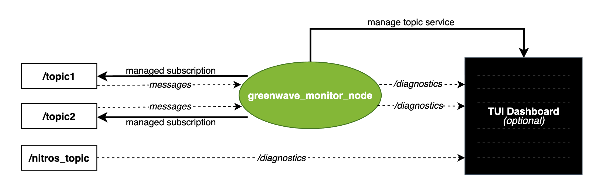

# Greenwave Monitor Design And Implementation Guide

This page explains how greenwave monitor is built, and how to inline
`greenwave_diagnostics` directly into your own ROS 2 node.

## Design Goals

- Provide low-overhead runtime topic diagnostics (rate, latency, jitter signals).
- Support both deployment styles:
  - centralized monitor node (`greenwave_monitor`)
  - inline diagnostics in producer/consumer nodes (`greenwave_diagnostics.hpp`)
- Publish standard `diagnostic_msgs/DiagnosticArray` on `/diagnostics` so multiple frontends can consume it.
- Provide a batteries included terminal based frontend for developers.

## Overall Design



### 1) Greenwave Diagnostic messages

The diagnostics messages published by greenwave monitor are standard ROS 2 Diagnostics messages (`diagnostic_msgs/DiagnosticArray`), however the dashboard relies on specific keys to associate the data with the correct topic, and to find frequency and latency data. We provide a header only library that creates these greenwave compatible diagnostics messages: `greenwave_monitor/include/greenwave_diagnostics.hpp`

`GreenwaveDiagnostics` tracks:

- node-time interarrival rate (`frame_rate_node`)
- message-time interarrival rate (`frame_rate_msg`) # Using the message's header timestamp
- current delay from realtime (`current_delay_from_realtime_ms`)
- jitter/outlier counters and summary stats
- status transitions (`OK`, `ERROR`, `STALE`) for missed timing expectations

In particular, the messages follow conventions from [Isaac ROS NITROS](https://github.com/NVIDIA-ISAAC-ROS/isaac_ros_nitros), which means configured NITROS nodes can be monitored by greenwave monitor frontends without any additional subscriber overhead. For example the drivers from [Isaac ROS Nova](https://github.com/NVIDIA-ISAAC-ROS/isaac_ros_nova) can be monitored out of the box. Furthermore, you can set `ENABLE_GLOBAL_NITROS_DIAGNOSTICS=1` to configure all NITROS nodes to publish diagnostics (more info [here](https://nvidia-isaac-ros.github.io/repositories_and_packages/isaac_ros_nitros/isaac_ros_nitros/index.html)).


### 2) Central monitor node (`greenwave_monitor`)

We provide a single node which can subscribe to arbitrary topics and produce greenwave diagnostics for them. You can think of this like a more efficient, more featureful version of ros2 topic hz. Implementation: `greenwave_monitor/src/greenwave_monitor.cpp`

- Starts a generic subscription per monitored topic.
- Reads topic list and parameters from:
  - `gw_monitored_topics`
  - `gw_time_check_preset` (see [Time check presets](#time-check-presets))
  - `gw_frequency_monitored_topics.<topic>.expected_frequency`
  - `gw_frequency_monitored_topics.<topic>.tolerance`
- Resolves topic type dynamically and uses serialized subscriptions.
- Extracts message timestamps for known header-bearing types (see `has_header_from_type()`).
- For topics without a header, uses node receive time; the time check preset controls which checks run.
- Publishes diagnostics once per second in `timer_callback()`.

Provides runtime services:

- `/greenwave_monitor/manage_topic` (`ManageTopic.srv`)
- `/greenwave_monitor/set_expected_frequency` (`SetExpectedFrequency.srv`)

### 3) UI adaptors

- `greenwave_monitor/greenwave_monitor/ui_adaptor.py` subscribes to `/diagnostics`.
- Maintains a table of topic->`DiagnosticStatus`
- Frontends render from a single dictionary maintained by the `GreenwaveUiAdaptor`, rather than a stream of diagnostics messages.

## Inline Integration In Your Own Node

The Greenwave Monitor Node is very convenient, and for most use cases it is sufficient. However sometimes the overhead from an extra subscriber is not desirable, or one wants to measure diagnostics directly from the publisher/subscriber. This section details how to integrate greenwave diagnostics inline. Reference pattern: `greenwave_monitor/src/example_greenwave_publisher_node.cpp`

### Step 1: Add the include and member

```cpp
#include "greenwave_diagnostics.hpp"

std::unique_ptr<greenwave_diagnostics::GreenwaveDiagnostics> gw_diag_;
```

### Step 2: Construct diagnostics in your node constructor

```cpp
greenwave_diagnostics::GreenwaveDiagnosticsConfig config;
config.enable_all_topic_diagnostics = true;

gw_diag_ = std::make_unique<greenwave_diagnostics::GreenwaveDiagnostics>(
  *this, "/my_topic", config);
```

Optional expected-rate checks (enables jitter/deadline logic):

```cpp
gw_diag_->setExpectedDt(/*expected_hz=*/30.0, /*tolerance_percent=*/10.0);
```

### Step 3: Update diagnostics per message event

Call `updateDiagnostics(msg_timestamp_ns)` whenever you publish or consume.

```cpp
const auto stamp_ns = msg.header.stamp.sec * 1000000000ULL + msg.header.stamp.nanosec;
gw_diag_->updateDiagnostics(stamp_ns);
```

If your message has no header, pass node time:

```cpp
gw_diag_->updateDiagnostics(this->now().nanoseconds());
```

### Step 4: Publish diagnostics periodically

`updateDiagnostics()` does not publish by itself.
Call `publishDiagnostics()` from a timer (for example, 1 Hz):

```cpp
diag_timer_ = this->create_wall_timer(
  std::chrono::seconds(1),
  [this]() { gw_diag_->publishDiagnostics(); });
```

## Diagnostics Contract (Important For UI Compatibility)

Dashboards expect specific keys inside `DiagnosticStatus.values`, including:

- `frame_rate_node`
- `frame_rate_msg`
- `current_delay_from_realtime_ms`
- `expected_frequency`
- `tolerance`

These are already emitted by `GreenwaveDiagnostics::publishDiagnostics()`. You can write your own publisher for greenwave compatible `/diagnostics`, but we don't guarantee schema stability for now.

## Timestamp sources

Greenwave diagnostics tracks two timestamp series for each monitored topic:

- **Header timestamp** — the `stamp` field embedded in the message's `std_msgs/Header`. For sensor data this is typically set at acquisition time (e.g. when a camera frame is captured), making it more accurate than node receive time for characterizing true source frequency and jitter.
- **Node receive time** — the wall-clock time when the ROS message callback fires, reflecting when the subscriber received the message including any network or queuing delays.

Latency (`current_delay_from_realtime_ms`) is measured as the difference between the node receive time and the header timestamp. A large value indicates significant pipeline delay between capture and consumption.

## Time check presets

The `gw_time_check_preset` node parameter controls which time-based checks run on each monitored topic. This is especially important for **headerless topics** (e.g. `std_msgs/String`), where message timestamps are not available and the monitor can optionally use node receive time instead.

| Preset value | Description |
|--------------|-------------|
| `header_with_nodetime_fallback` (default) | For header-bearing types: check message timestamp (rate, jitter, increasing). For headerless types: fall back to node time and run FPS window and increasing-timestamp checks. |
| `header_only` | Check message timestamp only. Headerless topics get no timing checks (diagnostics stay OK). Use when you only care about headered sources. |
| `nodetime_only` | Use node receive time for all topics (header and headerless). Runs FPS window and increasing-timestamp checks. |
| `none` | No time-based checks; only raw rate/latency values are computed and published. |

Configure via YAML or launch:

```yaml
greenwave_monitor:
  ros__parameters:
    gw_time_check_preset: header_with_nodetime_fallback  # or header_only, nodetime_only, none
    gw_monitored_topics: ['/my_topic']
```

Invalid values are ignored and the default `header_with_nodetime_fallback` is used (a warning is logged).

## Implementation Notes And Pitfalls

- Message timestamp should be epoch time for latency to be meaningful.
- The central monitor only parses headers for types listed in
  `GreenwaveMonitor::has_header_from_type()`; unknown types fall back to no-header behavior.
- `publishDiagnostics()` marks status as `STALE` if no fresh `updateDiagnostics()` happened since the previous publish.
- `setExpectedDt()` requires `expected_hz > 0`; zero disables useful timing checks.

## Where To Look In Code

- Core monitor node: [`greenwave_monitor/src/greenwave_monitor.cpp`](../greenwave_monitor/src/greenwave_monitor.cpp)
- Diagnostics API: [`greenwave_monitor/include/greenwave_diagnostics.hpp`](../greenwave_monitor/include/greenwave_diagnostics.hpp)
- Inline integration example node: [`greenwave_monitor/src/example_greenwave_publisher_node.cpp`](../greenwave_monitor/src/example_greenwave_publisher_node.cpp)
- Demo traffic generator node: [`greenwave_monitor/src/minimal_publisher_node.cpp`](../greenwave_monitor/src/minimal_publisher_node.cpp)
- Service definitions:
  - [`greenwave_monitor_interfaces/srv/ManageTopic.srv`](../greenwave_monitor_interfaces/srv/ManageTopic.srv)
  - [`greenwave_monitor_interfaces/srv/SetExpectedFrequency.srv`](../greenwave_monitor_interfaces/srv/SetExpectedFrequency.srv)

## Service API and CLI Usage

The monitor exposes two runtime services for dynamic configuration:

#### `ManageTopic`

Service type: `greenwave_monitor_interfaces/srv/ManageTopic`

Request fields:

- `topic_name` (string)
- `add_topic` (bool, `true` = add, `false` = remove)

Response fields:

- `success` (bool)
- `message` (string)

Examples:

```bash
# Add a topic
ros2 service call /greenwave_monitor/manage_topic \
  greenwave_monitor_interfaces/srv/ManageTopic \
  "{topic_name: '/topic2', add_topic: true}"

# Remove a topic
ros2 service call /greenwave_monitor/manage_topic \
  greenwave_monitor_interfaces/srv/ManageTopic \
  "{topic_name: '/topic2', add_topic: false}"
```

#### `SetExpectedFrequency`

Service type: `greenwave_monitor_interfaces/srv/SetExpectedFrequency`

Request fields:

- `topic_name` (string)
- `expected_hz` (float64)
- `tolerance_percent` (float64, e.g. `5.0` = 5%)
- `clear_expected` (bool)
- `add_topic_if_missing` (bool)

Response fields:

- `success` (bool)
- `message` (string)

Examples:

```bash
# Set expected frequency/tolerance
ros2 service call /greenwave_monitor/set_expected_frequency \
  greenwave_monitor_interfaces/srv/SetExpectedFrequency \
  "{topic_name: '/topic2', expected_hz: 30.0, tolerance_percent: 10.0, add_topic_if_missing: true}"

# Clear expected frequency
ros2 service call /greenwave_monitor/set_expected_frequency \
  greenwave_monitor_interfaces/srv/SetExpectedFrequency \
  "{topic_name: '/topic2', clear_expected: true}"
```

Note: topic names should include the leading slash (`/topic2`).

## Latency Measurements

Latency is calculated as the difference between the current system time and the timestamp in the message header. For this calculation to work correctly:

- The message type must have a `std_msgs/Header` field
- The message type must be in the recognized types list (see `has_header_from_type()` in `greenwave_monitor.cpp`)
- The header timestamp must be in epoch time (not boottime)

If any of these conditions are not met, the latency will be reported as **"N/A"** in the dashboard. This typically occurs when:
- The message type doesn't have a header (e.g., `std_msgs/String`, `geometry_msgs/Twist`)
- The message type is not recognized by greenwave monitor
- The header timestamp is in boottime format instead of epoch time

Currently, message types with headers must be manually registered in the `known_header_types` map in `greenwave_monitor.cpp`. Support for automatic detection of arbitrary message types may be added in the future. In the meantime, if you need support for a commonly used message type, please submit an issue or pull request to add it to the registry.
